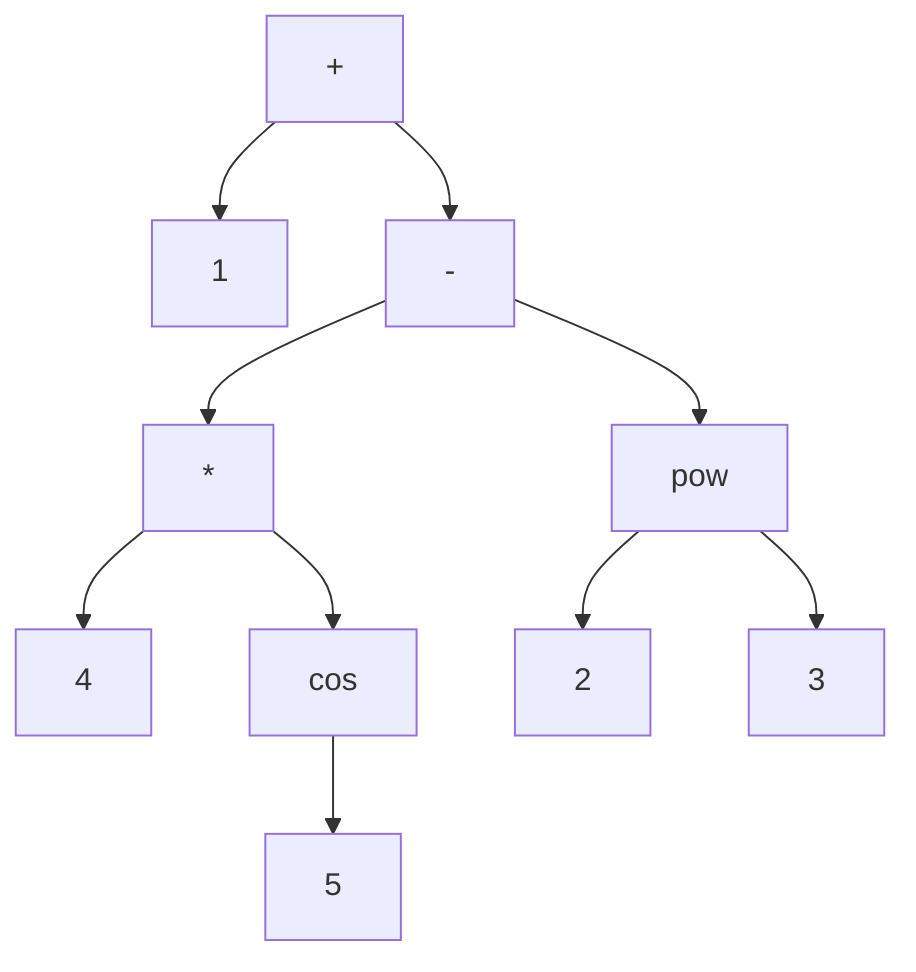

# Simple math evaluator

A Rust program to evaluate simple math expression with support for some math functions.

This project was done for the [Missing Semester](https://www.missingsemester.io/) participation submissions.

## Build & run

To quickly run the program, use the `run` command of Cargo:

```sh
# Example
cargo run -- '1 + 3'
```

To build a binary, use the `cargo build` command. The binary will be in `target/debug/math-eval`.

## How it works

The expression is tokenized and parsed following the grammar described in `grammar.txt`.

The expression passes into three stages:
- **Tokenizer**: The expression is transformed into a vector of tokens. There is five types of tokens: Operator, Number, Separator, Parenthesis and Function.

- **Parser**: The vector of tokens is transformed into an operation tree.

  - If the node value is a number, the children are empty (leaf node).
  
  - If the node value is an operator, each child is another tree. 
  
  - If the node value is a function, the left child is a tree. The right child is another tree if the function accepts two params and empty otherwise.

The tree below is the an example tree corresponding to the expression `1 + 4 * cos(5) - pow(2,3)`:



- **Evaluator**: The tree is traversed in depth post-order by applying the operations of the node on the children.

Each stage has its code in its own module: `tokenizer.rs`, `parser.rs` and `evaluator.rs`.

## Limitations

Currently, negative numbers are not supported.